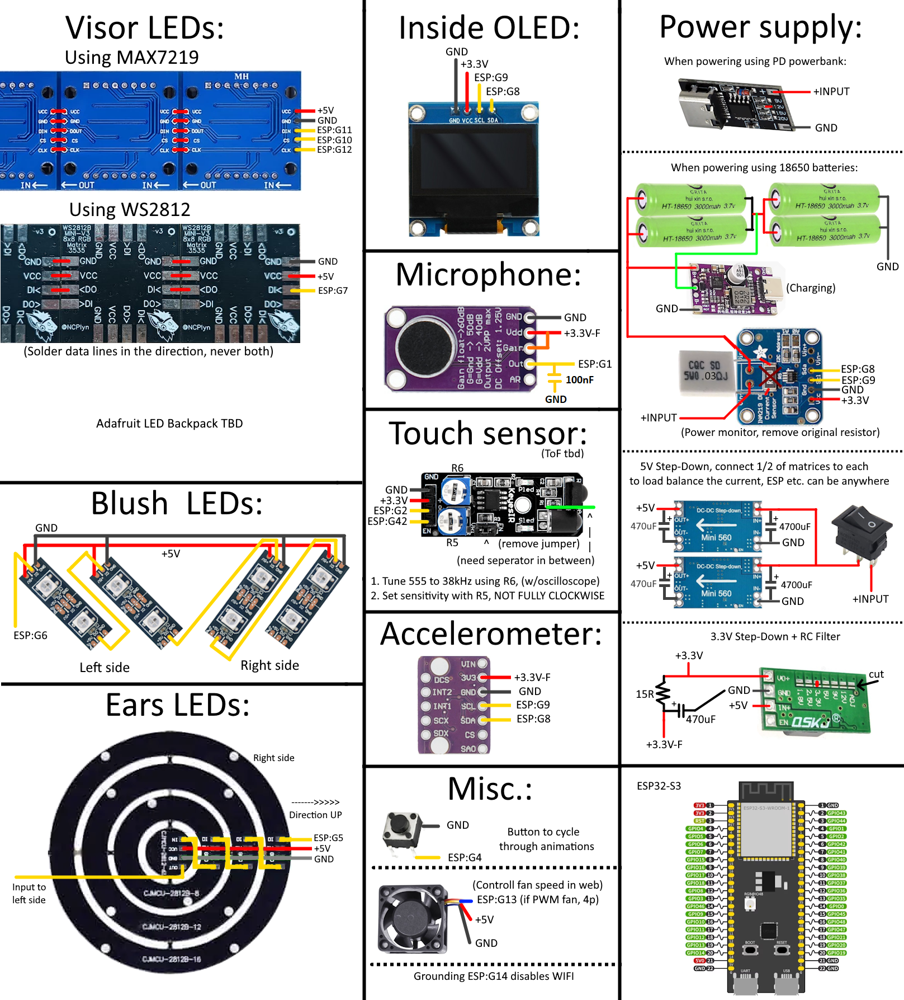

# ProtoESP - Controler
### The working brain of your Protogen!

### Main features
- TBD
## How to
### Build
- **Connect matrices in following order** (start at the right eye when your head is in the helmet)

- **Connect all available components according this schematic** (visor leds & power supply are the ones completely necessary, other are optional but preffered)

### Upload
- Install if not already: VS Code + PlatformIO extension and Python 3
- Clone this repository, open this folder with PlatformIO and let it download all needed files
- In `src/main.cpp`:
  - Change `visorType` definition for the display you have (WS2812 or MAX72XX)
  - Change `MAX72xx_DEVICES` or `visorLedsNum` to the correct amount of matrices/LEDs connected
  - Change `HARDWARE_TYPE` accordingly if your matrices are flipped or mirrored
  - Change `FADESTEPS` to the amount of steps to fade between frames (0 to disable - good for frames with <100ms)
  - Change `earPresent` if you're or not using ear LEDs
  - Change `blushPresent` if you're or not using blush LEDs (set `useRGBblush` to true if they are RGB and not GRB, for ear and visor color: `setup():FastLED.addLeds...`)
  - Change `INApresent` if you have or not INA219 connected
  - Change `boopMode` to what you use as boop sensor (`IR-KY` for KY032/active LOW or `Capac` for capacitive/active HIGH)
- In `platformio.ini`:
  - If using different capacity than n16r8, change to proper sized board (line 2)
  - If your board has lower flash capacity than 8MB, change partition file (line 11)
- Connect the ESP32S3 via COM USB connector and in the PIO tab open `esp32-s3`
- Click on `Upload` and after successful operation expand `Platform` dropdown and click on `Upload filesystem image`
- If `configCRC.txt` doesn't get automaticaly generated (`Generated CRC` in the terminal) while building the filesystem, run "genCRC_manual.py" manually and then `Upload filesystem image` again
- The ProtoESP should now be fully working and ready to configure if now errors are printed in the `Monitor`

### Use
- Connect to the ProtoESP WiFi AP named `ProtoWiFi` with password `Proto1234`
- Open any web browser and visit site `192.168.4.1` with mobile data turned off
- Change the password and name of the WiFi. (**Both minimum 9 chars!!**) You will have to reconnect after restarting the ESP!
- Here you can play any available animation, enable or disable features, configure variables and more!
- Click on `Save` after you're done setting things
- If you need to put the remote to defaults, power on the ESP and hold down the BOOT button for 10s
- For creating your own animations, visit the Animator!

<!-- OG ESP32 with SPI FLASH soldered on

#define MICpin ADC_CHANNEL_7 ////Microphone, pin 35
#define T_in 33 //Output from Touch Sensor
#define T_en 23 //Enable pin to Touch Sensor
#define DATA_PIN_EARS 5  //Ears (from outer to inner, right cheek first)
#define DATA_PIN_VISOR 19 //Face (right cheek, left segment of eye first)
#define I2C_SDA 21 //SDA for Gyro, OLED, INA219
#define I2C_SCL 22 //SCL for Gyro, OLED, INA219
#define MAX_CLK 14 //Clock for MAX72xx matrixes if used (HSPI)
#define MAX_MOSI 13 //Data for MAX72xx matrixes if used
#define MAX_CS 15 //ChipSelect for MAX72xx matrixes if used
#define animBtn 32 //Pulling this pin LOW cycles trough animations
#define fanPWM 25 //PWM pin to control 4pin fan

[env:esp32dev]
platform = https://github.com/pioarduino/platform-espressif32.git
board = esp32dev
framework = arduino
board_build.filesystem = littlefs
upload_speed = 921600
monitor_speed = 115200
monitor_filters = esp32_exception_decoder
board_build.partitions = 4MB_17-17-05.csv
extra_scripts = genCRC-auto.py
build_flags = 
	-DBOARD_HAS_PSRAM
	-mfix-esp32-psram-cache-issue
;	-DCORE_DEBUG_LEVEL=5
	-DELEGANTOTA_USE_ASYNC_WEBSERVER=1
lib_deps = 
	bblanchon/StreamUtils@1.9.0
	fastled/FastLED@3.7.8
	bblanchon/ArduinoJson@7.3.1
	sparkfun/SparkFun LSM6DS3 Breakout@1.0.3
	olikraus/U8g2@2.36.5
	h2zero/NimBLE-Arduino@2.2.3
	adafruit/Adafruit BusIO@1.17.0
	https://github.com/FrankBoesing/FastCRC.git
	majicdesigns/MD_MAX72XX@3.5.1
	arduinogetstarted/ezButton@1.0.6
	ESP32Async/AsyncTCP@3.3.8
	ESP32Async/ESPAsyncWebServer@3.7.4
	ayushsharma82/ElegantOTA@3.1.7

-->