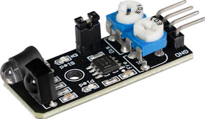
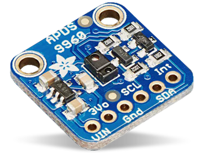
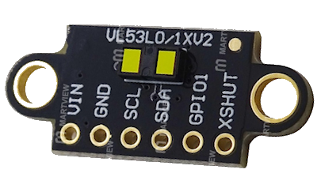
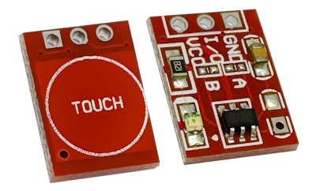

## Boop sensors
- Choose which one you want to use and then specify such in the main.cpp under `#define boopMode`

### KY-032

- Works by using 38kHz IR light and IR reciever to not be affected by sunlight etc...
- Has to be properly calibrated as written here: [irsensor.wizecode.com](http://irsensor.wizecode.com/)
- Needs additional shielding between the IR diode and reciever (sticking 1cm of plastic straw on each facing forward worked well enough)
- Might not detect non-reflective objects (black matte gloves etc...)
- Output pin connected to GPIO2 & Enable pin to GPIO42, powered by unfiltered 3.3V

### APDS9960

- Multipurpose chip with IR proximity detection which works on sunlight
- Connected to I2C with SDA on GPIO8 & SCL on GPIO9, powered by unfiltered 3.3V
- Best placed 1-2cm from visor pointing up or slightly forward.
- Might not detect small objects (aka booped by one finger etc..; 3+ or paws will be detected)
- Chinese clones should work too
- Has to be calibrated:
 - Visit [192.168.4.1/tof](http://192.168.4.1/tof) to see current sensor value
 - Nothing infront of visor value for example 240; hand on visor value for example 200
 - On the main page, set the Boop Threshold value to 220 and save.
 
### VL53L1X

- Time-of-Flight distance sensor which works on sunlight
- Connected to I2C with SDA on GPIO8 & SCL on GPIO9, powered by unfiltered 3.3V
- Best placed 1-2cm from visor pointing up or slightly forward.
- Might not detect small objects (aka booped by one finger etc..; 3+ or paws will be detected)
- Has to be calibrated:
 - Visit [192.168.4.1/tof](http://192.168.4.1/tof) to see current sensor value
 - Nothing infront of visor value for example 20; hand on visor value for example 3
 - On the main page, set the Boop Threshold value to 10 and save.
 
### "Capac"

- This option is universal and activates when GPIO2 is HIGH (3.3V applied)
- Mainly used for capacitive sensors
 - These will work only on bare fingers, not on paws/gloves!
- The pictured module needs to have both AB bridges unbridged! 
 - No self locking (not a toggle -> momentary switch)
 - HIGH TTL output (touched -> 3.3V on output))