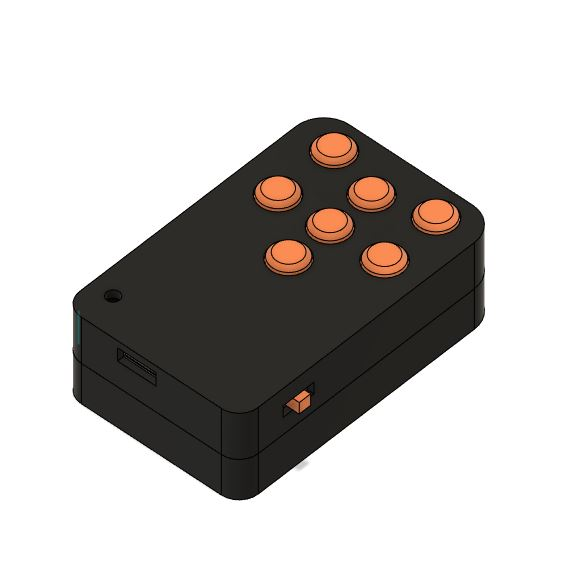
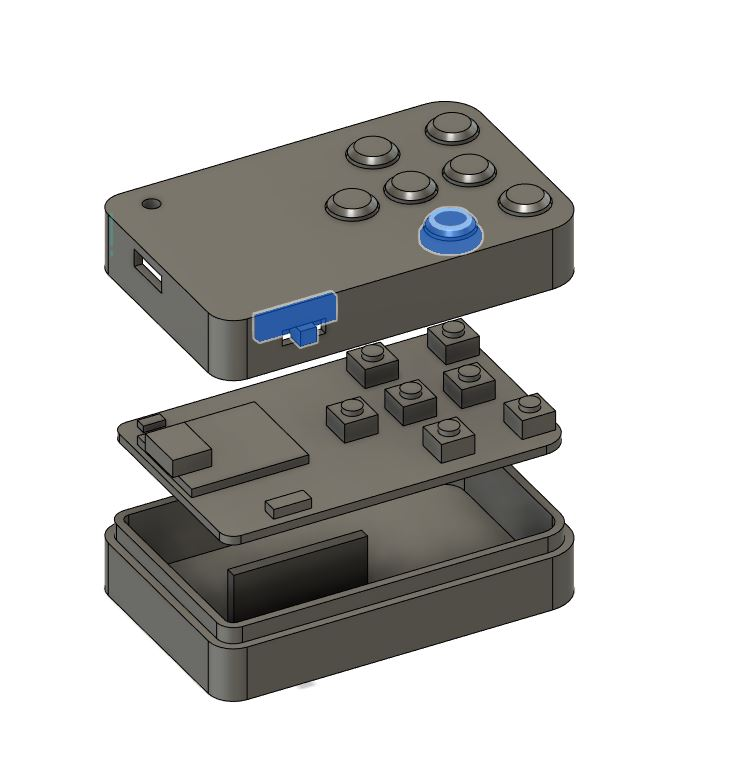
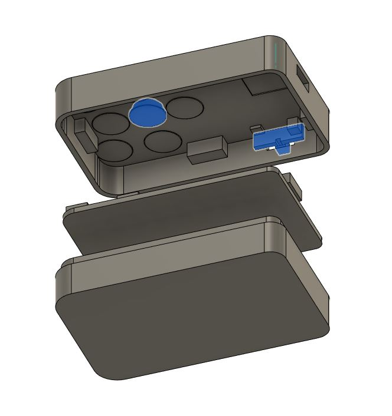

# Remote cover

Basic set of covers for the remote PCB

## Printing

- material: PET-G
- infill: 25%
- perimeters: 4
- supports: none

Printed with 2 colors. Print models marked `[a]` with accent color, the rest is printed with your main color. 

Number of items that should be printed of each model is marked in the file name.

## Assembly

- Prepare the PCB and the battery. 
- Prepare the `remote_box` part.
- Carefully place the the battery in the cavity of the box and secure with kapton tape 

- Prepare `remote-lid`, `remote-switch` and 7 `button` parts
- Insert `remote-switch` into opening in `remote-lid`, insert it at an angle and push it in, it should click into place
- Leave remote lid upside down and insert 7 `button`s 
- You can prop the lid using pencils, or secure the buttons using masking tape from outside if they fall out

- Carefully align the PCB and insert it into upside down `remote-lid`
- Take care that the switch on the PCB is correctly inserted into the slot in `remote-switch`
- Slide `remote-switch` back and forth, you should feel switch on the PCB switching on and off
- Check the PCB rests securely in `remote-lid`
- Fold the battery cables into the cavity of `remote_box`
- Now press the `remote_box` down into the `remote-lid`
- Take good care *not to pinch the cables or the battery* !
- The `remote_box` and `remote-lid` should fit precisely together with no gap on the side
- All 7 buttons should be easily clickable
- The switch should click on/off easily
- Cheers!
