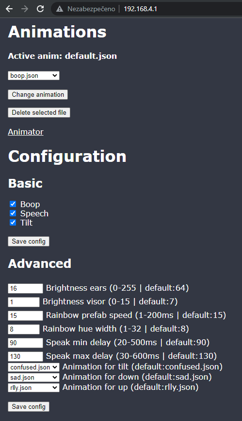
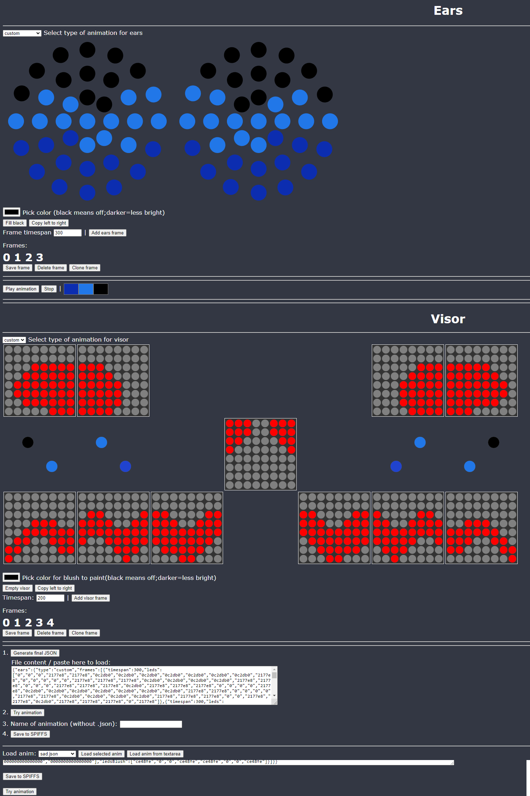

# A controller for your protogen!
- There's planned a big update (custom amount of displays, supported both MAX and WS28xx displays in the same codebase, using PSRAM & more!)... But I'm limited in my free time that I can give here so it will take a while!
- If you have found this project helpful or if you have used it and want to support me and encourage me into working more on this project, you can do so here: [PayPal.me](https://paypal.me/NCPlyn)
### Please read:
- If you experience any bug or want to add/suggest something, create an issue or pull request.
- There are two versions:
  - 'ESP-Proto' is for **MAX7219** visor displays and might not be up to date with newer features (OLED status display) but should work perfectly.
  - 'ESP-Proto_RGB' is for **WS2812B** visor displays (there's noone selling 8x8 32x32mm matrixes, BUT you can buy/make them yourself with files in "RGB-Matrix" folder).
- List of parts used: [Pastebin](https://pastebin.com/7z4fnVfQ)
- Progress on my protogen and guide on how to (not) build one: [Imgur](https://imgur.com/a/jYpSbuZ)
- If you are going to use this code for your protogen:
  - I'm not denying you of using my animations, but **try to make your protogen unique** and change them up a little bit in the Animator (either on the ESP32 web or open the html file in "Animator" folder) (Do not exceed the hardcoded amount of 16 frames!)
  - I needed to apply some code to fix my HW problems (wrongly oriented led/matrixes), so if you don't do such mistakes, you can remove that part of the code.
  - **Look through the code**, so you know how you should connect things (most of its is written as comments on the first few lines) and you know what does the code do!
- There's **remote control via BLE** (native on the ESP32 and the remote is Arduino Micro with HM-10 bluetooth module)!
  - If you're planning to use the remote, **look into the code, there are comments of what you have to do before hand!** (Short press switches animation. Long press cycles trough animations for that button. While not connected, press button on pin 3,4,7 at the same time to reset to default (has to be done on every Arduino flash). Settings are saved every 20s after long press of any button.)

