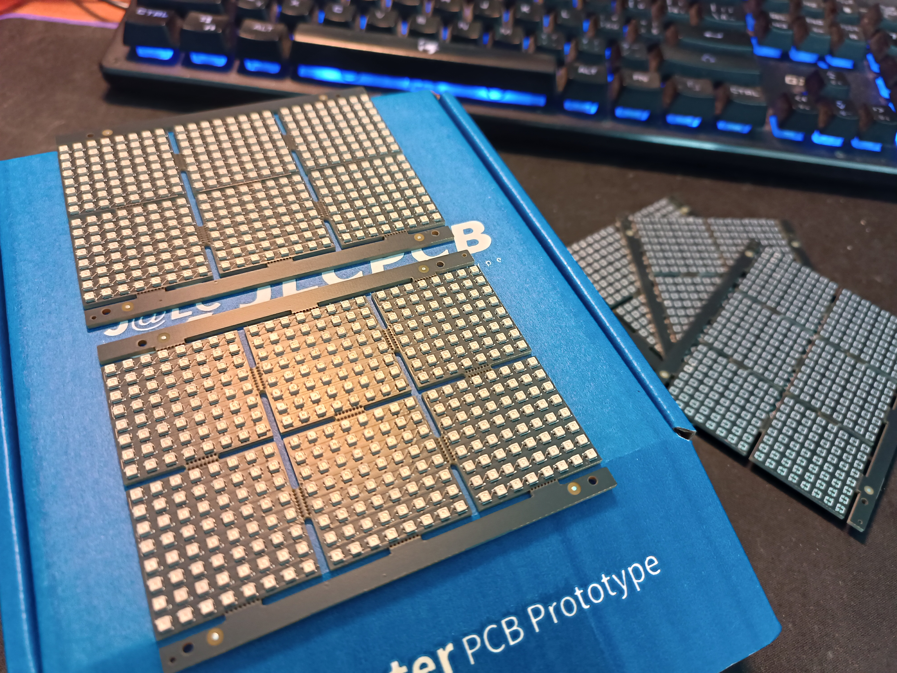

##Works but bad design for coding
- but the code here works for it without changing
- the diagram is like:
..1...2...3...4....5...6....7..8
16.15.14.13.12.11.10.9
17.18.19.20.21.22.23.24
.... you get the idea
- all files ready to order PCB and assembly on JLCPCB
- panelized

